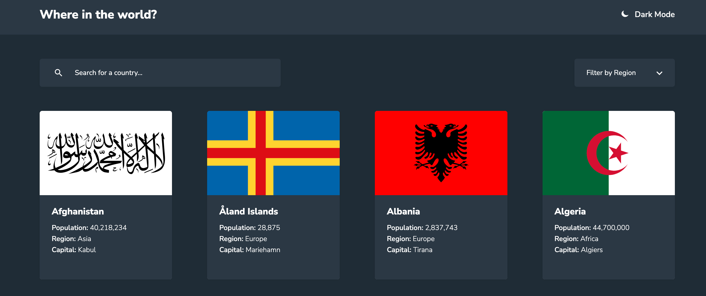

## Countries list



### Link to the project: https://countries-list-project.netlify.app/

## Features

- Fetches a list of countries from the REST Countries API.
- Displays the list of countries, showing basic information such as name and flag.
- Allows users to filter countries based on various criteria.
- Provides a detailed view for each country with information like population, area, languages, and more.
- Supports switching between light and dark themes.

## Tech stack

- Vue
- JS
- SCSS
- HTML

## Project setup

```
npm install
```

### Compiles and hot-reloads for development

```
npm run serve
```

### Compiles and minifies for production

```
npm run build
```

### Lints and fixes files

```
npm run lint
```

### Customize configuration

See [Configuration Reference](https://cli.vuejs.org/config/).
